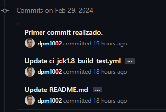
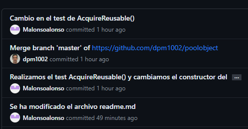
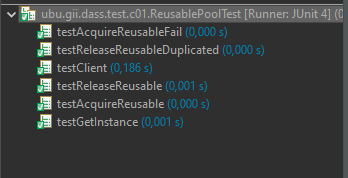
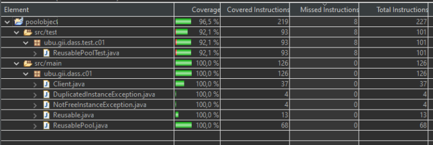
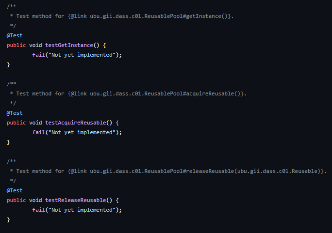
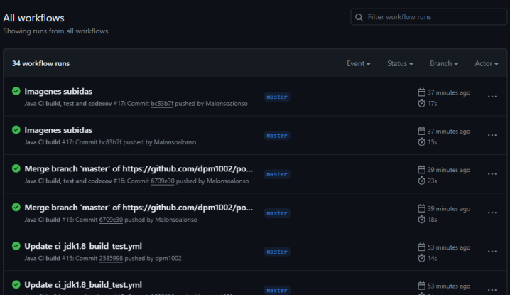

poolobject
==========

## INTRODUCCIÓN Y OBJETIVOS DE LA PRÁCTICA
Esta es la primera práctica de desarrollo avanzado de sistemas software. En esta simularemos un pequeño desarrollo de un producto software y crearemos un repositorio github con el que podremos caracterizarlo y evaluarlo.

 	
 	

Java code example of creational design pattern pool object

Workshop to use good practices in software development: testing, ci and measurement.

Authors:

- David Pérez Moreno
- Miguel Alonso Alonso

## PREGUNTAS SOBRE EL TRABAJO REALIZADO SOBRE LA PRÁCTICA

### ¿Se ha realizado trabajo en equipo?
Sí, el trabajo se ha ido realizando en conjunto ya que ambos miembros del grupo han ido realizando diferentes commits a lo largo de la práctica donde se puede observar la aportación de cada uno de ellos.

  

### ¿Tiene calidad el conjunto de pruebas disponibles?
Sí, debido que tanto el conjunto de pruebas, como la cobertura de código han sido realizadas de una manera en la que se ha podido tener en cuenta todas las partes del código. En cuanto a calidad, estamos probando todas las caracteristicas que se nos piden.

### ¿Cuál es el esfuerzo invertido en realizar la actividad?
Se ha invertido tanto el tiempo disponible en los horarios de clases prácticas, como otras tantas horas en nuestras casas para poder realizar la práctica de la manera más completa y exhaustiva posible. Ya que se necesita tiempo no solo para implementar la funcionalidad en eclipse, como también para entender el funcionamiento de la herramienta de github.

### ¿Cuál es el número de fallos encontrados en el código original?
En el código original en la parte de ReusablePoolTest nos encontramos con fragmentos del código, los cuales no estan implementados y son fallos debido a que a la hora de la ejecución, debido al método fail(), estan dando error.
Nos encontramos con 3 líneas de código de error.

### ¿El proceso de integración continua realizado ha sido de calidad?
Sí, hemos realizado la integración continua de una manera correcta, pudiendose comprobar desde la pestaña de actions en github que se esta realizando de una manera automatica.

